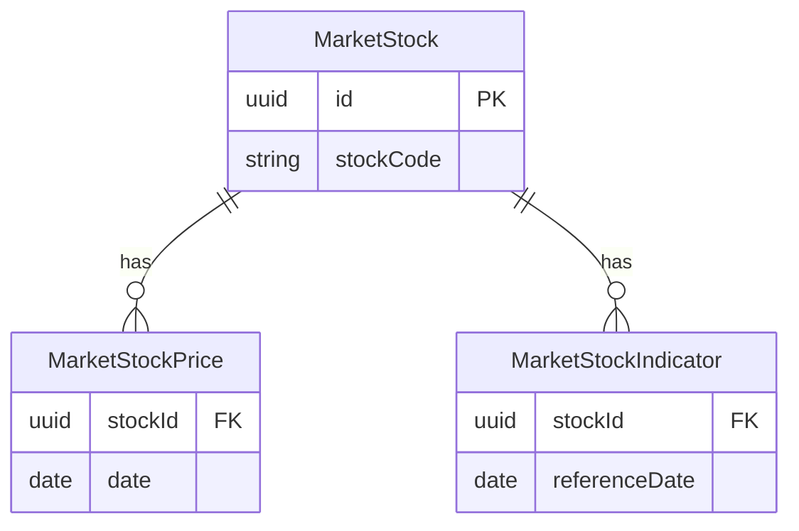

# Market Service Overview

Market 서비스는 종목 기본정보, 현재가, 과거 일별 시세와 투자지표를 수집·저장·조회하고 Trading 서비스와 사용자 화면에 시장 데이터를 제공한다.

## 1. Market 서비스의 역할

Market 서비스는 다음 질문에 답하기 위한 데이터를 관리한다.

- **이 종목은 무엇인가?**: 종목코드, 종목명, 시장 구분 같은 기본정보를 제공한다.
- **지금 가격은 얼마인가?**: 현재 장중 가격을 Redis 캐시 또는 KIS API에서 조회한다.
- **과거 날짜별 가격은 얼마였는가?**: PostgreSQL에 저장된 일별 시세를 제공한다.
- **현재 저장된 최신 투자지표는 무엇인가?**: 저장된 PER, PBR 등의 가장 최근 지표를 제공한다.

핵심 기능은 다음처럼 연결된다.

```text
종목 기본정보 -> 사용자가 종목을 검색하고 식별
현재가 -> 현재 장중 가격 확인
과거 일별 시세 -> 차트와 백테스트에 사용
투자지표 -> 종목 분석과 투자 전략 조건에 사용
```

## 2. 테이블이 3개인 이유

### `m_market_stocks`: 이 종목은 누구인가?

종목의 기준정보를 한 행으로 저장한다. `stockCode`, `stockName`, `marketType`, `industryCode`, `listedShares`, `marketCap`이 여기에 해당한다.

- `stockCode`는 삼성전자의 `005930`처럼 외부 API와 사용자 요청에서 사용하는 **비즈니스 키(업무에서 의미가 있는 식별값)** 다.
- UUID `id`는 내부 기본 키(PK)이며, 가격과 투자지표 테이블이 종목을 연결할 때 사용한다.
- 한 종목당 기본정보는 한 행이다.

### `m_market_stocks_price`: 이 종목은 날짜별로 얼마였는가?

한 종목의 가격 이력을 저장한다. 거래일(`date`)별 시가(`openPrice`), 고가(`highPrice`), 저가(`lowPrice`), 종가(`closePrice`), 누적 거래량(`accumulatedVolume`), 누적 거래대금(`accumulatedTradeAmount`)을 보관한다.

- 한 종목에는 여러 거래일의 가격 행이 존재한다.
- KIS REST 일봉 데이터는 `time IS NULL`, `source = REST`로 구분한다.
- REST 일봉만 `stock_id + date`가 중복되지 않도록 PostgreSQL Partial Unique Index(특정 조건의 데이터에만 중복 방지 규칙을 적용하는 인덱스)를 사용한다.
- 현재가 API는 사용자가 조회할 때마다 이 테이블에 가격 이력을 저장하지 않는다.

### `m_market_stocks_indicator`: 이 종목의 투자지표는 어떠한가?

종목의 기준일별 투자지표 스냅샷(특정 시점의 기록)을 저장한다. `referenceDate`, `per`, `pbr`, `eps`, `bps`, `roe`가 해당한다.

- 한 종목에는 여러 기준일의 투자지표 행이 존재할 수 있다.
- `stock_id + reference_date` 조합은 중복되지 않는다.
- `referenceDate`는 지표 자체가 기준으로 삼는 날짜이고, `createdAt`은 이 서비스가 그 행을 만든 시각이다. 최신 지표 조회는 먼저 `referenceDate`가 더 최신인 행을 선택하고, 같은 기준일이면 `createdAt`이 더 최신인 행을 선택한다.

## 3. 테이블 관계



`MarketStockPrice`와 `MarketStockIndicator`는 `MarketStock.id` UUID를 각각 `stockId`로 저장해 종목과 연결한다. 즉, 종목 하나에 여러 가격 기록과 여러 투자지표 기록이 연결되는 구조다.

## 4. 테이블을 하나로 합치지 않은 이유

종목 기본정보는 자주 바뀌지 않지만, 일별 시세는 거래일마다 계속 쌓이고 투자지표는 별도의 기준일과 갱신 주기를 가진다. 한 테이블에 합치면 종목명과 시장 구분이 가격 날짜마다 반복되고, 가격과 투자지표가 항상 같은 날짜에 생성된다는 잘못된 전제가 생긴다.

| 데이터 | 의미 | 변경 주기 | 저장 위치 |
| --- | --- | --- | --- |
| 종목 기본정보 | 종목 식별 정보 | 낮음 | PostgreSQL |
| 현재가 | 현재 장중 가격 | 매우 높음 | Redis |
| 과거 일별 시세 | 거래일별 확정 가격 | 거래일마다 | PostgreSQL |
| 투자지표 | 기준일별 기업 지표 | 지표 갱신 시 | PostgreSQL |

현재가는 장중에 계속 달라지는 값이고, 일별 종가는 한 거래일이 끝난 뒤 확정된 가격이다. 따라서 현재가 조회 결과를 일별 시세 이력으로 바로 저장하지 않는다.

## 5. 지금까지 구현된 조회 API

### 현재가 조회

`GET /quote?stockCode=005930`

- 요청 헤더 `X-User-Id`가 필요하다.
- Redis를 먼저 조회한다.
- Cache MISS(캐시에 데이터가 없는 상태)면 User Service에서 KIS 인증정보를 받아 KIS 현재가 API를 호출한다.
- 조회 결과는 Redis에 저장하지만, 사용자 조회 중 PostgreSQL 가격 이력에는 저장하지 않는다.

### 종목 목록, 검색, 상세

기본 경로는 `/api/v1/market/stocks`다.

- `GET /api/v1/market/stocks`: PostgreSQL `m_market_stocks`를 페이지 단위로 조회한다. `marketType` 필터를 지원하고, 정렬 필드는 `stockCode`, `stockName`, `marketType`만 허용한다.
- `GET /api/v1/market/stocks/search?keyword=삼성`: 종목명 또는 종목코드 부분 검색이다. PostgreSQL만 조회하며 KIS와 Redis를 사용하지 않는다. `%`, `_`, `!`는 LIKE 검색의 와일드카드가 아닌 일반 문자로 처리한다.
- `GET /api/v1/market/stocks/{stockCode}`: 종목 기본정보를 조회한다. 종목코드 형식 오류와 정상 형식이지만 존재하지 않는 종목을 구분한다.

### 최근 일별 시세

`GET /api/v1/market/stocks/{stockCode}/prices?days=30`

- `days`의 기본값은 `30`이며, `1`부터 `365`까지만 허용한다.
- PostgreSQL의 REST 일봉(`time IS NULL`, `source = REST`) 중 `closePrice`가 있는 행만 조회한다.
- DB에서 최신 N개 거래일을 선택한 뒤, 응답은 과거 날짜부터 최신 날짜 순서로 반환한다.
- 요청 중 KIS를 호출하거나 데이터를 저장하지 않는다. 데이터가 부족해도 현재 저장된 데이터만 반환한다.

### 최신 투자지표

`GET /api/v1/market/stocks/{stockCode}/indicators`

- PostgreSQL에 저장된 지표 중 `referenceDate` 내림차순, 같은 기준일이면 `createdAt` 내림차순으로 최신 한 건을 조회한다.
- 종목이 없을 때와 종목은 있지만 투자지표가 없을 때를 서로 다른 404 오류로 구분한다.
- 요청 중 외부 API를 호출하거나 데이터를 저장하지 않는다.

| API | 의미 | 데이터 출처 | DB 저장 발생 |
| --- | --- | --- | --- |
| `GET /quote` | 지금 가격 | Redis 또는 KIS | 없음 |
| `GET /api/v1/market/stocks`, `/search`, `/{stockCode}` | 종목 찾기 | PostgreSQL | 없음 |
| `GET /api/v1/market/stocks/{stockCode}/prices` | 과거 가격 | PostgreSQL | 없음 |
| `GET /api/v1/market/stocks/{stockCode}/indicators` | 최신 저장 지표 | PostgreSQL | 없음 |

## 6. 삼성전자 조회 예시

1. `GET /api/v1/market/stocks/search?keyword=삼성`으로 `m_market_stocks`를 검색해 삼성전자와 `005930`을 찾는다.
2. `GET /quote?stockCode=005930`으로 Redis 또는 KIS에서 지금 가격을 확인한다.
3. `GET /api/v1/market/stocks/005930/prices?days=30`으로 `m_market_stocks_price`의 저장된 날짜별 가격을 확인한다.
4. `GET /api/v1/market/stocks/005930/indicators`로 `m_market_stocks_indicator`의 최신 PER, PBR, EPS, BPS, ROE를 확인한다.

## 7. 조회 API와 내부 저장 Command 구분

**Query(조회)** 는 이미 저장된 데이터를 읽는다. **Command(명령)** 는 외부 데이터를 가져오거나 전달받은 데이터를 저장한다.

| 기능 | HTTP API 여부 | 역할 |
| --- | --- | --- |
| 현재가 조회 | O | Redis 또는 KIS에서 현재가 조회 |
| 종목 목록·검색·상세 | O | PostgreSQL의 종목정보 조회 |
| 일별 시세 조회 | O | PostgreSQL의 일별 시세 조회 |
| 투자지표 조회 | O | PostgreSQL의 최신 지표 조회 |
| 일별 시세 수집·저장 | X | KIS 일별 시세를 PostgreSQL에 저장 |
| 종목 마스터 저장 | X | 외부 종목정보를 PostgreSQL에 upsert |
| 투자지표 수집·저장 | X | 현재 Service 또는 진입점이 구현되어 있지 않음 |

`MarketStockPriceCommandService.collectAndSaveDailyPrices(...)`는 KIS 일별 시세 수집 후 저장을 담당한다. `MarketStockMasterCommandService.saveMasterStocks(...)`는 외부 수집기가 전달한 종목 마스터를 저장한다. 두 Command 모두 현재 Controller 또는 Scheduler와 연결된 진입점이 없다.

## 8. 사용자 조회 중 저장하지 않는 이유

사용자 조회 요청은 필요한 데이터를 읽기만 하고, 외부 데이터 수집은 별도의 Command 또는 Scheduler가 담당해야 한다.

`/prices`나 `/indicators`에 데이터가 없다고 해서 KIS를 호출하고 DB에 저장하면 다음 문제가 생긴다.

- 외부 API 지연이 사용자 응답 시간에 직접 영향을 준다.
- 조회 요청이 예상하지 못한 DB 변경을 만든다.
- 외부 API 장애가 단순 조회 API 장애로 확대된다.
- Query와 Command의 책임이 섞여 유지보수가 어려워진다.

## 9. 현재 구현 상태와 제한사항

- 종목 마스터 저장 Command는 구현되어 있지만, 종목 전체를 수집하는 외부 수집기·Controller·Scheduler 진입점은 구현되어 있지 않다.
- 일별 시세 수집·저장 Command는 구현되어 있지만, Controller 또는 Scheduler 진입점은 구현되어 있지 않다.
- 투자지표는 Entity와 Command Repository만 존재하며, 수집·저장 Service 및 진입점은 구현되어 있지 않다.
- DB에 종목 마스터가 없으면 목록·검색 결과가 비어 있거나 종목 상세 조회가 미존재 오류를 반환할 수 있다.
- DB에 일별 시세가 없으면 `/prices`는 빈 목록을 반환한다.
- DB에 투자지표가 없으면 `/indicators`는 투자지표 미존재 오류를 반환한다.
- Docker 환경 문제로 실제 PostgreSQL 통합 동작은 별도 검증이 필요하다.
